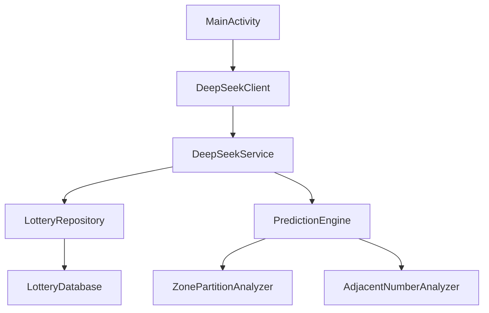

# 项目架构分析报告

## 1. 模块依赖关系


## 2. 资源引用统计
| 资源类型 | 文件数 | 主要用途 |
|---------|--------|----------|
| Layout | 12 | 活动/对话框/列表项 |
| Drawable | 5 | 图标/背景 |
| Values | 8 | 主题/颜色/字符串 |

## 3. 关键架构问题
### 问题1：循环依赖
- **位置**: `DeepSeekService` ↔ `PredictionEngine`
- **风险**: 编译耦合度高
- **建议**: 引入事件总线解耦

### 问题2：资源冗余
- **文件**: `res/layout-sw600dp/activity_deepseek_chat.xml`
- **建议**: 改用ConstraintLayout适配不同尺寸

## 4. 性能优化点
1. **数据库访问**:
   ```kotlin
   // LotteryRepository.kt
   @Transaction
   suspend fun getRecordsWithCache() = withContext(Dispatchers.IO) {
       // 添加内存缓存
   }
   ```

2. **分析引擎优化**:
   ```kotlin
   // ZonePartitionAnalyzer.kt
   fun analyzeParallel(records: List<LotteryRecord>) = 
       records.parallelStream().forEach { /*...*/ }
   ```

## 5. 架构改进建议
1. 引入Dagger/Hilt依赖注入
2. 分离数据层与业务层
3. 增加模块化支持
```kotlin
// settings.gradle.kts
include(":data", ":domain", ":presentation")
```
